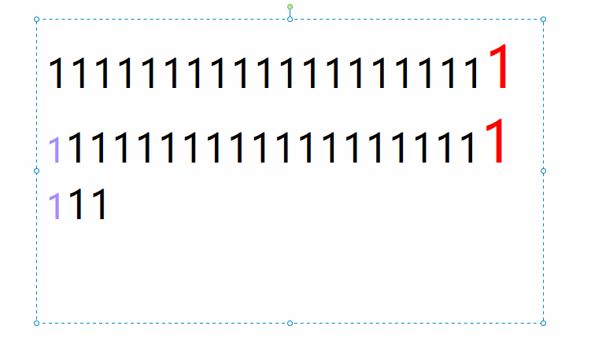

# 行为定义

## 光标

### 段内换行的光标行为

在一段文本超过文本框的宽度尺寸时，将会进行换行。在光标移动到第二行的行首时，此时的光标应该跟随哪个字符的样式

在段内换行的行首时的光标，有三个不同的选择行为：

行为1：

光标将按照光标前一个字符的属性进行显示，输入时也继承光标前一个字符的样式。这是 PPT 的行为，如下图

不过在 Word 中，光标的尺寸是一个诡异的跟随，既不是光标前一个字符的，也不是光标后一个字符的，也不是段落默认字符属性的，如下图

行为2：

光标将按照段落属性，而不是跟随光标前一个字符的属性。这是在 EN 的行为，如下图

光标只要进入新行，那就采用段落样式，段落样式的更改之后在段落第一个字符之前才能更改，如下图是进行更改段落的字符属性，更改之后，进入新行之后即可让光标使用段落字符属性，如下图

行为3：

光标在进入第二行的行首时，将按照光标后一个字符的属性进行显示。暂时没有找到任何一个软件使用此行为
